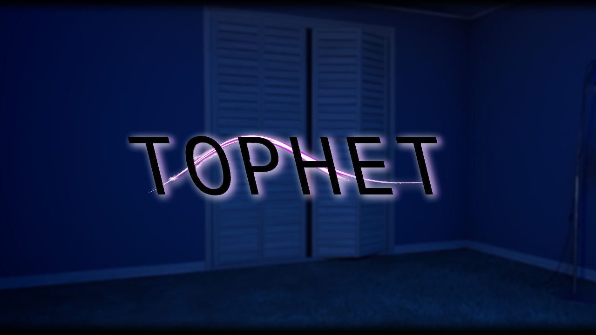
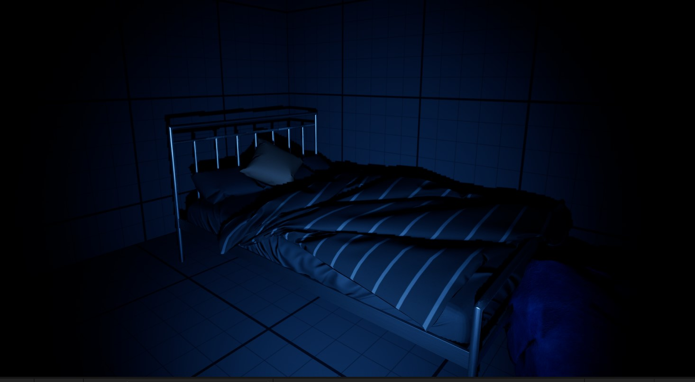
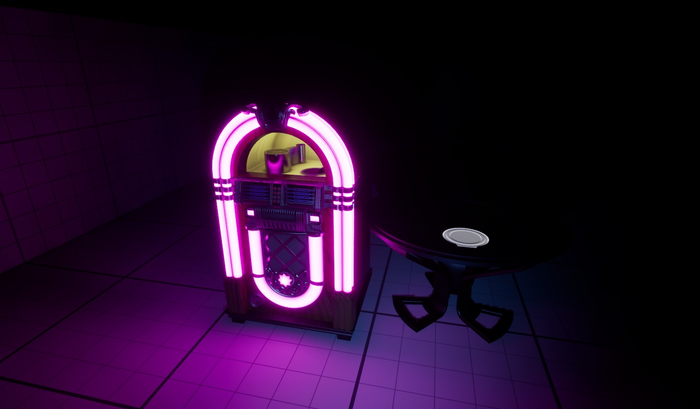
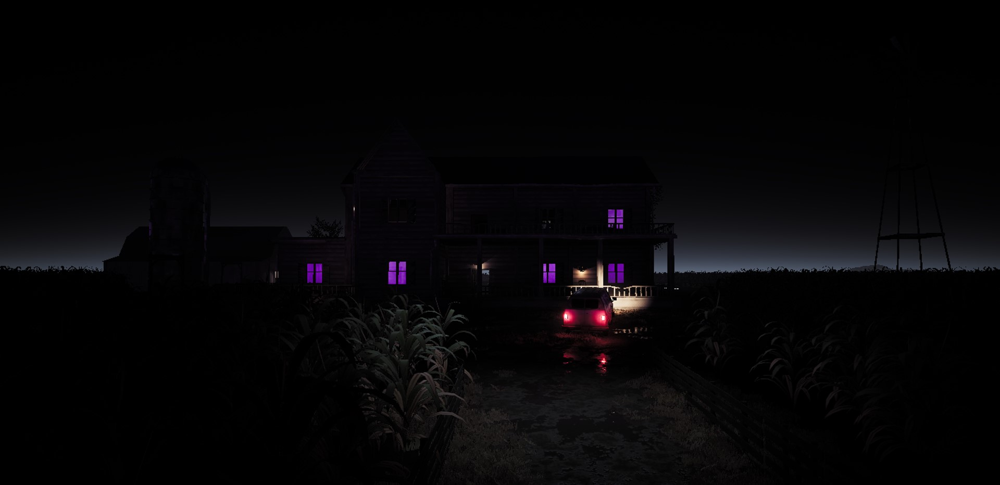
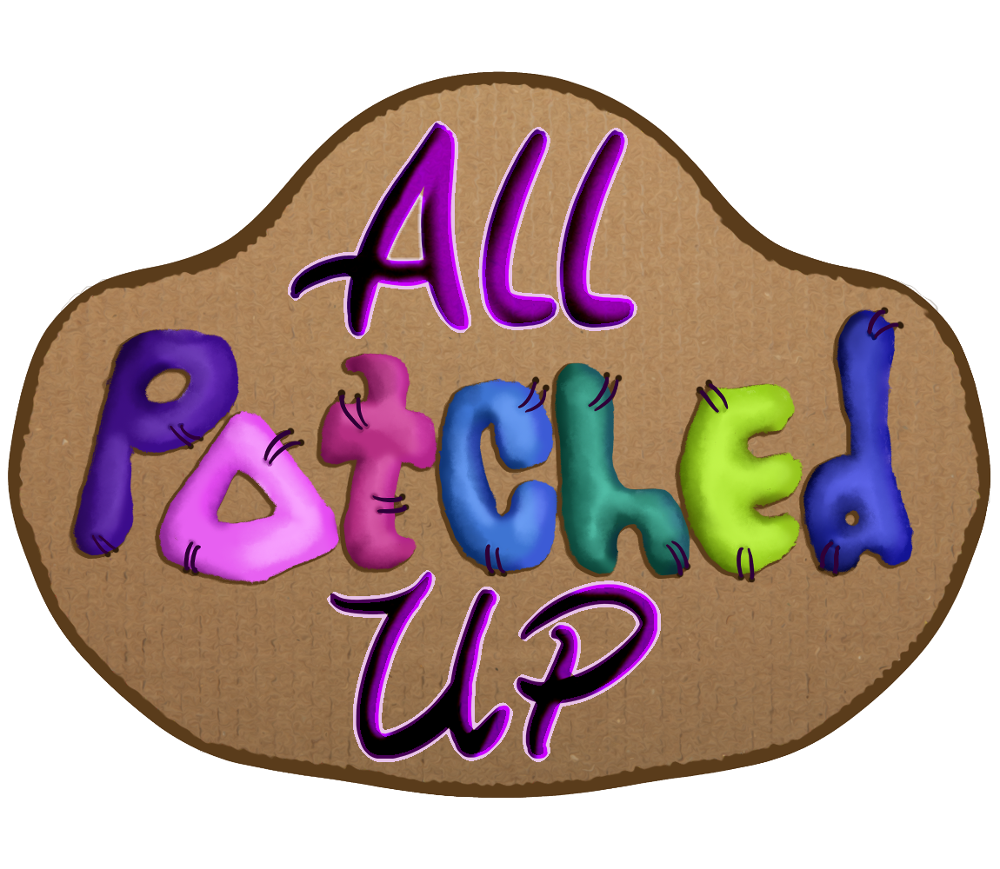
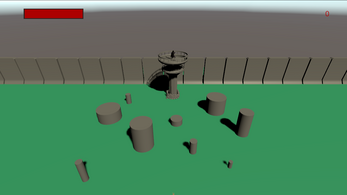

## Tophet

Tophet is a short survival first-person horror game.   In order to escape the nightmare, you must find the pentagram and locate all the cursed items. 
------------------------------------------------------------------------------------------------------------------------------------------------------
 This game is entirely coded using blueprints such as:

 
Ai Movement,
Game instance,
Characters,
Game Actors / Items,
Level seqeunces,
Save points,
UI,
Mobile UI,
Animations,
Video Overlays,

* [Itch.io](https://zinidev.itch.io/tophet)

## All Patched Up

As part of major preduction. All Patched Up is an adventure platforming  game about a patchwork doll, Tack, leaving their dismal home behind.
----------------------------------------------------------------------------------------------------------------------------------------------
Coded only using blueprints

* [Itch.io](https://teamfire2021.itch.io/allpatchedup)

## Tower Defense

As part of production. Tower Defense is a survival game to see how long you can last against a wave of endless enemys.
-----------------------------------------------------------------------------------------------------------------------
 Coded in C#

 
 Programmed the player, player navmesh, and spider animator 

* [Itch.io](https://gutstowerdefence.itch.io/tower-defence)
* [Repository](https://github.com/zionmatthews/TowerDefense)
